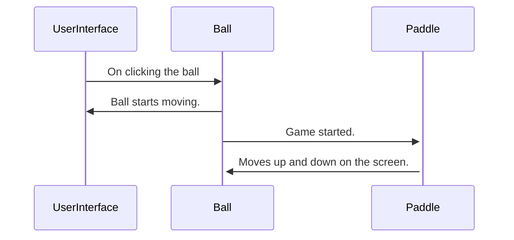
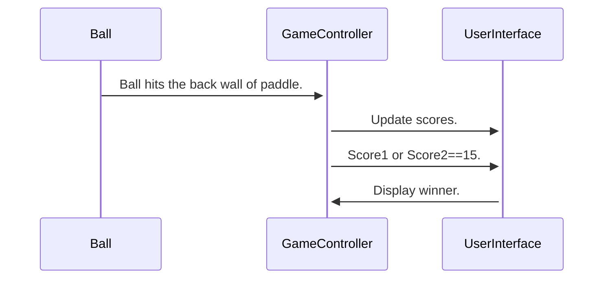

# Interaction Sequences

## Startup Sequence

Before entering the game user can change the default UI
setting which includes background, ball and paddle color.
On clicking the start button, the user interface of the game
is visible with paddles , ball and intial score of
both the players.

```mermaid
sequenceDiagram
UserInterface->>+GameController: User click start button.
GameController->>+UserInterface: Initial scores of player 1
and 2 set to zero.
```

## Movement Initiation



## One score


