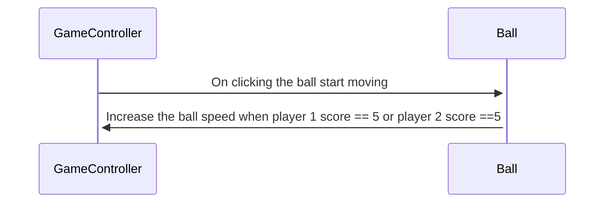
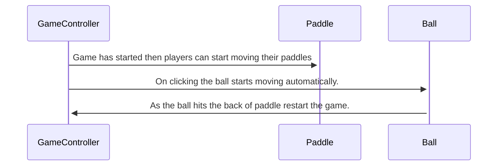
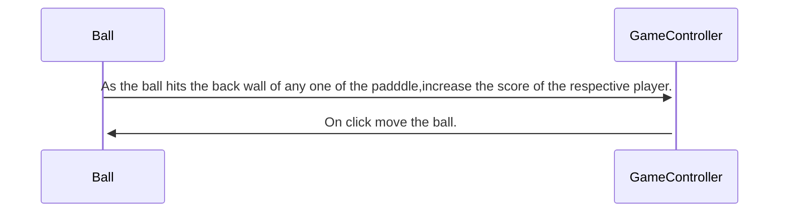

# Interaction Sequences

## Startup Sequence

```mermaid
sequenceDiagram
GameController->>+Ball: On clicking the ball start moving
Ball->>+GameController: Increase the ball speed when player 1 score == 5 or player 2 score ==5
```

## Movement Initiation

```mermaid
sequenceDiagram
GameController->>+Paddle: Game has started then players can start moving their paddles
GameController->>+Ball: On clicking the ball starts moving automatically.
Ball->>+GameController: As the ball hits the back of paddle restart the game.
```

## One score

```mermaid
sequenceDiagram
Ball->>+GameController: As the ball hits the back wall of any one of the padddle,increase the score of the respective player.
GameController->>+Ball: On click move the ball.

```
